# soothfast

<p align="center">
  
</p>

<p align="center">
  <a href="https://github.com/Verdenroz/soothfast/actions/workflows/ci.yml"></a>
  <a href="https://verdenroz.github.io/soothfast/coverage/"></a>
  <a href="LICENSE"></a>
</p>

<p align="center">
  <a href="#how-it-works"><code>how it works</code></a>
  &nbsp;·&nbsp;
  <a href="#quick-start"><code>quick start</code></a>
  &nbsp;·&nbsp;
  <a href="#in-ci"><code>in ci</code></a>
  &nbsp;·&nbsp;
  <a href="#dogfood"><code>dogfood</code></a>
  &nbsp;·&nbsp;
  <a href="#workspace"><code>workspace</code></a>
  &nbsp;·&nbsp;
  <a href="https://verdenroz.github.io/soothfast/"><code>full guide</code></a>
</p>

Annotate a function, get a checked benchmark. The output below is real,
produced by this exact code on every CI run:

```rust capture-output
use soothfast::measured;

#[measured(group = "indicators", alloc = 0)]
pub fn rsi() -> f64 {
    let closes = [
        44.0, 44.25, 44.5, 43.75, 44.65, 45.1, 45.4, 45.8, 46.0, 45.6,
    ];
    let deltas: Vec<f64> = closes.windows(2).map(|w| w[1] - w[0]).collect();
    let gain: f64 = deltas.iter().filter(|d| **d > 0.0).sum();
    let loss: f64 = deltas.iter().filter(|d| **d < 0.0).map(|d| -d).sum();
    100.0 - 100.0 / (1.0 + gain / loss)
}

fn main() {
    println!("rsi={:.2}", rsi());
}
```

```text soothfast-output
rsi=70.51
```

Docs and performance work the same way. Both are written from the code and
checked against it on every build. Adding soothfast costs one runtime
dependency (`linkme`); everything else lives in the separate
`cargo-soothfast` binary.

## How it works

<p align="center">
  
</p>

`cargo soothfast measure` records perfcnt, callgrind, walltime and alloc
counts into a baseline. `cargo soothfast gate` fails CI as soon as a fresh
run regresses past a threshold. The `<!-- soothfast:bind -->` and
`<!-- soothfast:claim -->` markers tie markdown prose to that same run, so a
stale README fails CI instead of going unnoticed.

There is more than benchmarks here. Spec reconciliation, SDK generation,
trend charts, changelog drafts and an agent-facing MCP server are all
covered in the **[full guide](https://verdenroz.github.io/soothfast/)**.

## Quick start

```toml
[dev-dependencies]
soothfast = { version = "0.1.0", features = ["runner"] }

[[bench]]
name = "soothfast"
harness = false
```

```rust no_run feature=runner
// benches/soothfast.rs
soothfast::bench_main!();

mod mylib {
    pub fn sorted(input: &[f64]) -> Vec<f64> {
        let mut v = input.to_vec();
        v.sort_by(|a, b| a.partial_cmp(b).unwrap());
        v
    }
}

#[soothfast::fixture]
fn values_n(n: usize) -> Vec<f64> {
    (0..n).map(|i| (n - i) as f64).collect()
}

// Checked claims: complexity verified by size sweep, alloc count exact.
#[soothfast::bench(group = "sort", setup_sized = values_n, sizes(1024, 4096, 16384),
                 complexity = "n log n", alloc = 2, covers = "mylib::sorted")]
fn bench_sorted(input: &[f64]) { soothfast::keep(mylib::sorted(soothfast::keep(input))); }
// Route constant inputs through soothfast::keep or LLVM const-folds them away.
```

<details>
<summary>Full CLI reference</summary>

```console
$ cargo soothfast measure -p mylib --save-baseline base   # backends probe: perfcnt/callgrind/walltime/alloc
$ cargo soothfast gate -p mylib                           # vs baseline; exit 1 on regression
$ cargo soothfast gate -p mylib --against-ref origin/master --ratchet v1.0  # merge-base + ratchet
$ cargo soothfast docs gen-tests -p mylib                 # markdown blocks -> tests + capture examples
$ cargo soothfast docs capture -p mylib                   # run examples, splice real output into docs
$ cargo soothfast docs check -p mylib                     # binds + claims + generated-artifact manifest
$ cargo soothfast docs accept -p mylib                    # re-lock soothfast.lock after verifying prose
$ cargo soothfast spec check -p myserver                  # #[route] vs OpenAPI/GraphQL/MCP specs
$ cargo soothfast report render -p mylib                  # perf tables, trend SVGs, badges, llms.txt
$ cargo soothfast mcp -p mylib                            # agent-facing server on stdio
```

See the **[guide](https://verdenroz.github.io/soothfast/)** for gating
thresholds, ratchets, the full bind/claim/capture syntax, and spec
reconciliation.

</details>

```markdown ignore
<!-- soothfast:bind mylib::sorted -->
Prose describing `sorted`. CI fails if the code changes under it.
<!-- /soothfast:bind -->

<!-- soothfast:claim mylib::checksum.perfcnt.instructions < 25000 -->
Numbers in prose become gated facts.
```

## In CI

A composite action installs the CLI on GitHub Actions, pinned to the
`soothfast` version in your `Cargo.lock` and cached across runs:

```yaml ignore
- uses: Verdenroz/soothfast@<tag-or-sha>
- run: cargo soothfast gate -p mylib --against-ref origin/master
```

`soothfast-measure` builds into your bench binary from the lock, so an
unpinned CLI silently outruns it. The `version` input overrides the pin;
`lockfile` points at a `Cargo.lock` outside the working directory. Outputs
are `version` and `cache-hit`.

Add `step-security/harden-runner` as the job's own first step if you use it.
The action deliberately leaves that to the caller.

## Dogfood

CI runs soothfast on soothfast. Seven crates each carry a bench target
measured into a fresh baseline on every build, and this README is checked
against it. The sentences below are checked claims rather than comments:

<p align="center">
  
</p>

<!-- soothfast:bind soothfast::keep -->
Constant inputs and results route through `soothfast::keep`, the `black_box`
equivalent. Without it LLVM const-folds the measured body away, which is the
easiest way to measure nothing at all.
<!-- /soothfast:bind -->

<!-- soothfast:claim soothfast_registry::bench_fnv1a.alloc.allocs <= 0 -->
Registry fingerprinting (FNV-1a over the normalized token stream) never
allocates.
<!-- /soothfast:claim -->

<!-- soothfast:claim soothfast_measure::bench_summarize.alloc.allocs <= 8 -->
Summary statistics, meaning median and MAD over a sample set, cost a handful
of allocations per call. Eight is the gated ceiling.
<!-- /soothfast:claim -->

## Workspace

| Crate | Role |
|---|---|
| `soothfast` | User-facing facade: `#[measured]`, `keep`, registry re-exports |
| `soothfast-macros` | Proc-macros |
| `soothfast-registry` | linkme distributed slices, stable IDs, FNV-1a fingerprints |
| `soothfast-measure` | Measurement engine + metric backends |
| `soothfast-docs` | rustdoc JSON ingestion, bind blocks, doc-test generation |
| `soothfast-spec` | Declared-surface reconciliation: OpenAPI/AsyncAPI/GraphQL/MCP |
| `soothfast-sdk` | Python and TypeScript client emitters, with optional embedded servers |
| `soothfast-report` | Renderers: perf tables, trend charts, changelogs, llms.txt |
| `soothfast-site` | The docs-site engine behind `docs build` |
| `cargo-soothfast` | The CLI: everything CI calls |

<p align="center">
  
</p>

<p align="center">
  <em>soothfast</em> is Old English <em>sōþfæst</em>: "fixed in truth." MIT licensed.
</p>
